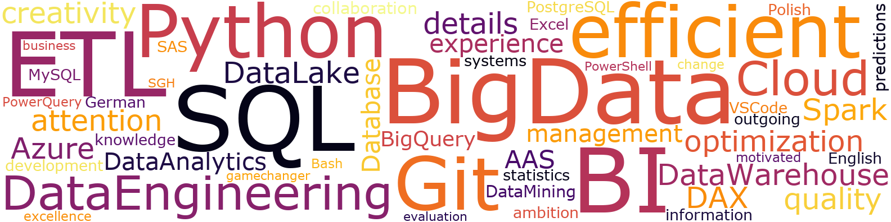

# Word Cloud Generator
Make a word cloud out of a given list of words or a text.

## Contents
* [General Info](#general-info)
* [Getting Started](#getting-started)
* [Prerequisites](#prerequisites)
* [How to use](#how-to-use)
* [Inspiration](#inspiration)

## General Info
Word cloud, also known as word collage or tag cloud, is a technique of visual representation of the most frequently occurring words in the given text. It helps to quickly present and highlight the most common and most important words or answers in case of a survey or feedback.

Word Cloud Generator is a script in Python which allows you to create a visualisation of word data in a form of a cloud using list of words or simply a plain text. By adjusting script parameters and the text you can manipulate and shape the resulting image; change resolution, font or backgroud colours and frequency or weight of presented words etc.

## Getting Started

### Prerequisites

* Python - version 3.9.7
* wordcloud - version 1.9.3
* matplotlib - version 3.8.3
* (Optional) python-docx - version 1.1.0

### How to use
To run the script you need to have Python and a few libraries installed listed in prerequisites section. File words_list.txt contains a list of words which is required to make the script work. You can use it as is or create a custom one.

## Inspiration
:bulb: I found out about the concept of a word cloud during my studies and the project I was working on back then and I liked the idea. Later on, I thought "Why not get more creative and print the result on the mug as a gift or create a descriptive LinkedIn background and also have fun learning some Python?".